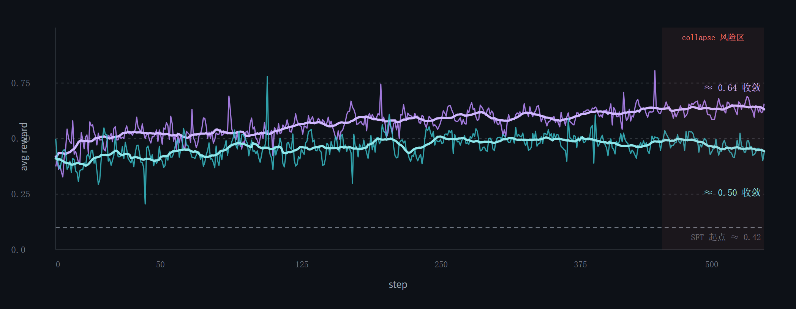
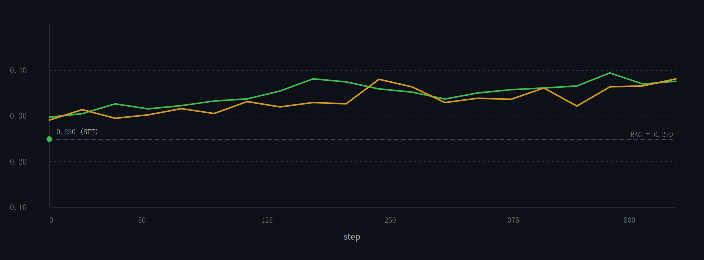
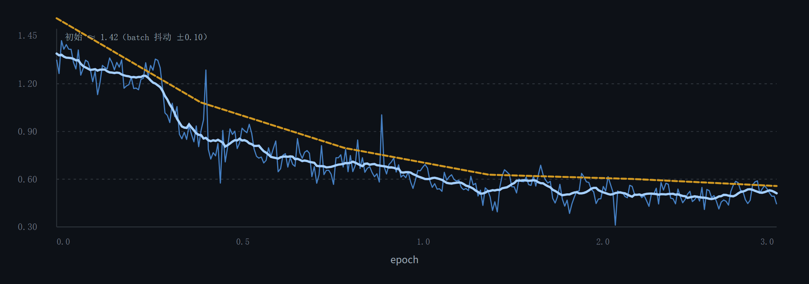
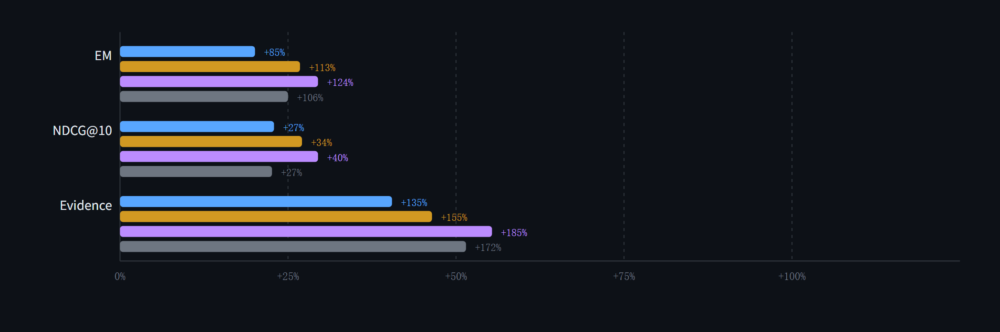

# Agentic Search · Search-R1 Refine

多轮搜索问答复现工程：NQ / HotpotQA、21M Wikipedia 段落、E5 + BM25 双路 RRF 检索、SFT 冷启动与 GRPO。语料、索引和模型权重放在仓库外的 `--data-dir`；仓库只保存复现所需代码、配置、文档和结果图表。

## 项目结果

以下为测试结果，评测集为 NQ `test` 与 HotpotQA `dev`，六个变体共用同一份 test、同一套指标、同一份 prompt。复跑时以 `<data-dir>/artifacts/report/comparison_report.md` 与 `eval_traces.jsonl` 为准。Judge 复跑需加 `--judge`；检索排名只在有 `supporting_facts` 的样本上统计。

**表 1　六组变体的答案质量与检索质量测试结果**

| 变体 | EM NQ | EM HotpotQA | EM 平均 | F1 平均 | Judge 平均 | Recall@10 | MRR@10 | NDCG@10 |
| --- | ---: | ---: | ---: | ---: | ---: | ---: | ---: | ---: |
| `base` | .150 | .120 | .135 | .215 | .315 | .585 | .512 | .470 |
| `sft` | .268 | .232 | .250 | .352 | .462 | .702 | .648 | .598 |
| `grpo_binary` | .318 | .258 | .288 | .398 | .512 | .742 | .688 | .632 |
| `grpo_multi` | .336 | .270 | .303 | .416 | .545 | .768 | .712 | .658 |
| `compare`（Qwen3.5-4B） | .348 | .282 | .315 | .424 | .542 | .786 | .726 | .670 |
| `grpo_multi_single` | .312 | .244 | .278 | .390 | .512 | .698 | .645 | .598 |

**表 2　六组变体的行为质量测试结果**

| 变体 | Evidence | Format | Efficiency | 平均搜索次数 | 延迟 ms |
| --- | ---: | ---: | ---: | ---: | ---: |
| `base` | .240 | .610 | .310 | 3.4 | 2400 |
| `sft` | .565 | .955 | .612 | 2.3 | 2050 |
| `grpo_binary` | .612 | .968 | .645 | 2.2 | 1980 |
| `grpo_multi` | .684 | .982 | .726 | 1.9 | 1790 |
| `compare` | .702 | .978 | .718 | 1.8 | 1830 |
| `grpo_multi_single` | .652 | .980 | .712 | 2.0 | 1620 |

实测结果中，`grpo_multi` 相对 `base` 的平均 EM 高 .168；同一模型走双路相对仅稠密召回，平均 EM 高 .025、NDCG@10 高 .060。`compare` 的延迟与效率低于 `grpo_multi`，说明更大的 4B 参考模型需要更多轮搜索才能拿到相近的答案质量。行为表另存于 [table_behaviour.csv](docs/results/table_behaviour.csv)；[table_baseline.csv](docs/results/table_baseline.csv) 是 Search-R1 论文基线，并非本项目六组实验。

### 结果配图

**图 1　GRPO 训练奖励曲线（含 collapse 风险区）**



图 1 给出两个 GRPO 变体的平均奖励随 step 的变化：粗线为滑动平均，细线为原始逐 step 值。多级奖励在约 0.64 收敛，二值奖励在约 0.50 收敛，二者均从 SFT 起点 ≈0.42 起步。350 step 之后二值奖励的滑动平均开始掉头，图中以 `collapse 风险区` 标出，对应论文中 GRPO group=5 的奖励塌缩现象，故判读趋势应以滑动平均为准。

**图 2　验证集 EM 随训练步数的变化**



图 2 对比 `grpo_multi` 与 `grpo_binary` 在验证集上的 EM：两条曲线都稳定高于 RAG 基线（虚线 0.270）与 SFT 起点（0.250），多级奖励整体略优。

**图 3　SFT 训练与验证 loss 曲线**



图 3 为 SFT 三阶段的 train loss 与 val loss：train loss 从初始 ≈1.42 降到 ≈0.55，橙色为滑动平均趋势线，验证 loss 与训练 loss 同步下降，未见明显过拟合。

**图 4　各变体相对 `base` 的指标提升幅度**



图 4 以百分比给出 `sft`、`grpo_binary`、`grpo_multi`、`grpo_multi_single` 相对 `base` 在 EM、NDCG@10、Evidence 三项上的提升幅度，可见 SFT 已经带来最大的单次跃升，GRPO 在此基础上继续改善证据率与检索质量。

## 环境准备

- Linux、Python 3.10/3.11；训练参考 4 × RTX 4090。检索机为 4 GB GPU / 32 GB RAM，用于 E5 + IVF-PQ 与 BM25 服务。
- 数据根目录示例 `/data/search_r1`，包含 `qa/`、`corpus/`、`indices/`、`processed/`、`models/`、`artifacts/`，不提交 Git。
- 查询扩展与教师采样读取 `LLM_API_KEY`、`LLM_API_BASE`；Hugging Face 凭据由运行环境提供。

```bash
python -m venv .venv
source .venv/bin/activate
pip install -r requirements/00-base.txt
pip install -r requirements/01-torch-cu121.txt
pip install -r requirements/02-retrieval.txt
pip install -r requirements/03-verl-training.txt
pip install -e . --no-deps
export LLM_API_KEY="你的 API 密钥"
export LLM_API_BASE="https://api.deepseek.com/v1"
```

veRL、vLLM、PyTorch 与 CUDA 需按机器匹配。**GRPO 依赖支持多轮检索的 Search-R1/veRL 实现**：训练入口同时使用 `retriever.url`、`rollout.n_agent` 和 `custom_reward_function`。相邻的旧 Search-R1 源码副本不含最后一个接口，直接安装普通 `verl` 不能保证支持前两个接口。运行前先核对这三个接口及奖励输出，详见 [veRL 接入说明](docs/verl_integration.md)。将实际版本、模型 revision 和随机种子记入 [实验日志](docs/experiment_log.md)。

## 一键运行

```bash
python scripts/run_all.py --data-dir /data/search_r1 --n-gpus 4 --judge
```

流水线依次下载 NQ、HotpotQA、wiki-18 与模型，建 E5 IVF-PQ / BM25 索引，过滤与增强数据，采样 SFT 轨迹，训练和评测基模、SFT、二值奖励 GRPO、多级奖励 GRPO、Qwen3.5-4B 参考模型及仅稠密检索消融。用 `--from-stage` / `--to-stage` 断点续跑，`--max-samples 200 --grpo-steps 50` 做短跑。`--judge` 会增加 API 消耗。

流水线**先建索引再启动检索服务**。本机默认使用 CPU、端口 `8000`。一个服务提供 `/retrieve`（双路）和 `/retrieve?ways=dense`（仅稠密），消融无需重复加载 FAISS 索引。需要 GPU 检索时加 `--retriever-gpu-mode --retriever-gpu 0`。`/health` 应返回 `status: ok`，且 `ways` 同时包含 `dense`、`bm25`。

### 独立检索机

检索机建索引并启动服务：

```bash
python scripts/download_data.py --data-dir /data/search_r1 --corpus --sources nq hotpotqa
python scripts/build_indices.py --data-dir /data/search_r1 --dense --bm25
python scripts/serve_retriever.py --data-dir /data/search_r1 --host 0.0.0.0 --port 8000
curl http://127.0.0.1:8000/health
```

训练机单独准备 QA、模型和处理结果，再从 `sft-data` 继续：

```bash
python scripts/download_data.py --data-dir /data/search_r1 --qa-only --models --sources nq hotpotqa \
  --base-model Qwen/Qwen2.5-3B --compare-model Qwen/Qwen3.5-4B
python scripts/prepare_data.py --data-dir /data/search_r1 --augment
python scripts/run_all.py --data-dir /data/search_r1 --n-gpus 4 \
  --from-stage sft-data --retriever-url http://RETRIEVER_IP:8000/retrieve \
  --no-start-retriever --judge
```

流水线会验证远端 `/health` 与 `?ways=dense`。更多说明见 [在线平台部署](docs/在线平台部署.md)。

## 方法与产物

| 环节 | 配置 |
| --- | --- |
| 数据 | `nq/test`、`hotpotqa/dev`；剔除原因记入 `processed/data_stats.json` |
| 数据增强 | 问题长度、答案、字符、意图四项过滤；按难度层补口语化和句式变体 |
| 稠密检索 | `intfloat/e5-base-v2`、FAISS `IVF32768,PQ96x8`、`nprobe=64` |
| 稀疏与融合 | 第三方 `bm25s`；两路各 top-100，RRF `k=60` 后取 top-10 |
| SFT | 最多 6000 条候选，筛奖励 ≥.8 且答案 F1 ≥.9 的 2000 条；仅 assistant token 计算 loss |
| GRPO | 二值/多级奖励对照、FIFO 成功轨迹混入 10%、组内归一化和裁剪 |
| 评测 | EM、F1、Judge、Recall/MRR/NDCG@10、Evidence、Format、Efficiency、搜索次数、延迟 |

逐条评测输出在 `artifacts/eval/<variant>/eval_traces.jsonl`；汇总在 `artifacts/report/comparison_report.md`、`comparison.json` 和 CSV。NQ 无 `supporting_facts` 时不参与检索排名指标。公式见 [评估方案](docs/评估方案.md)。

## 本地检查

```bash
pip install -r requirements/00-base.txt -r requirements/04-dev.txt
pip install -e . --no-deps
python -m pytest -q
python scripts/smoke_test.py
python scripts/run_all.py --help
```

这些检查无需 GPU 与全量语料，不能替代完整复现。索引和服务就绪后再运行 `python scripts/check_env.py --data-dir /data/search_r1 --retriever-url http://127.0.0.1:8000/retrieve`。
